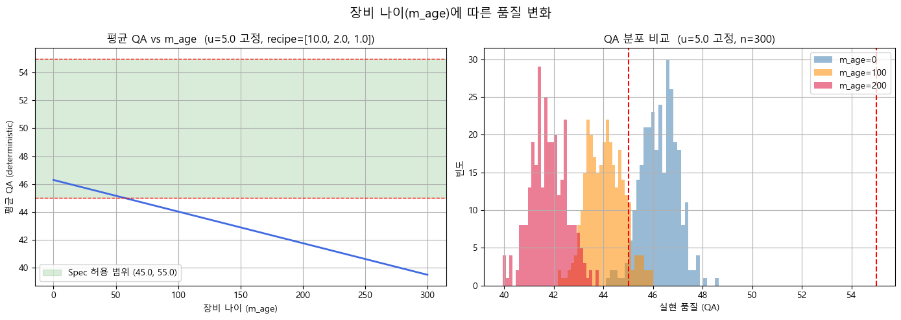
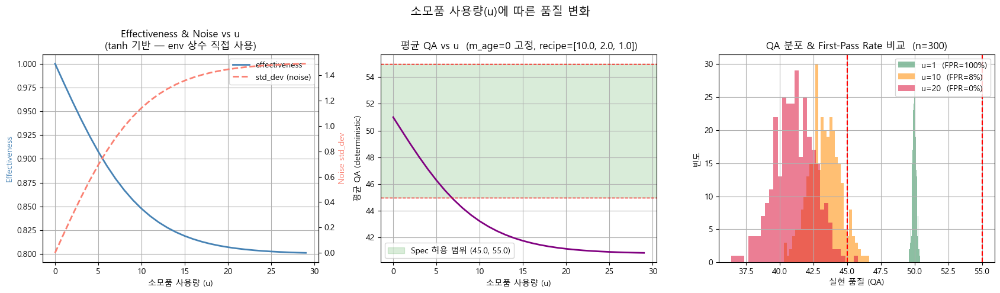
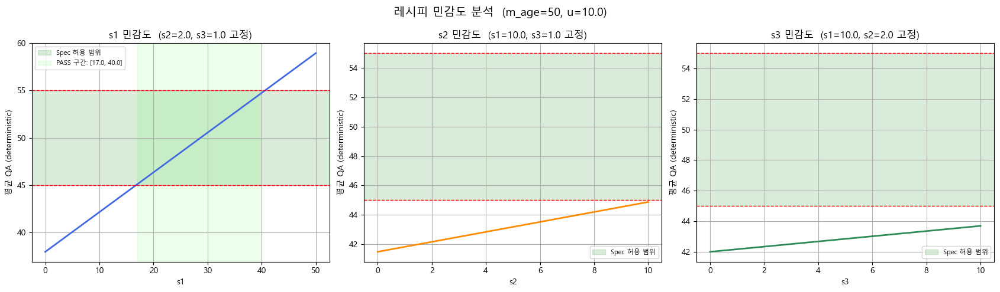
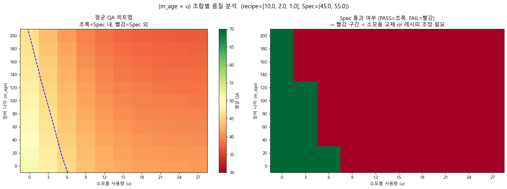
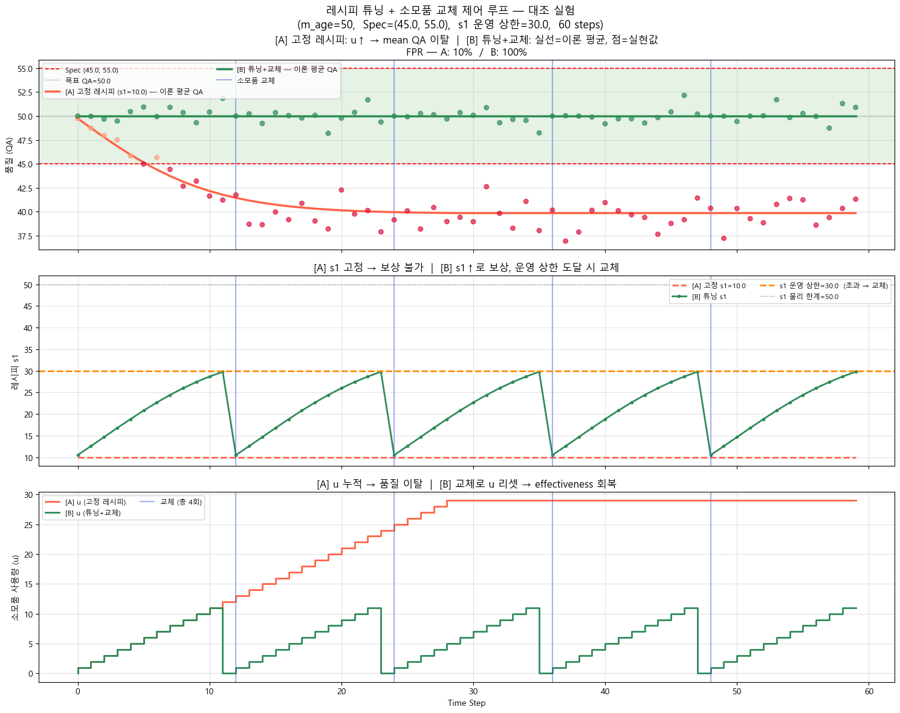

# Extensible Manufacturing Simulation Toolkit

A researcher's handbook for modular manufacturing simulation and algorithm development.

## Preface

Modern manufacturing research increasingly requires fast iteration across three tightly coupled decision layers:
1. State transition and process physics.
2. Scheduling and dispatching.
3. Process control and recipe adaptation.

This repository is designed as a modular research sandbox where those layers are separable, composable, and testable.
The practical goal is simple: a researcher should be able to take this codebase, plug in a new algorithm, run controlled experiments, and report reproducible results without rewriting the environment core.

The default production path is `A -> B -> C`, but the architecture is intentionally extensible to additional processes, additional policies, and additional control paradigms.

This handbook is organized by chapter and focused on implementation. It explains both what exists today and how to extend it safely.

For an empirical walkthrough of the Process A physical model — including degradation curves, recipe sensitivity, and control loop simulation — see `notebooks/01_Process_A_example.ipynb`. The figures in Chapter 3 are generated from that notebook.


## Table of Contents

1. [Preface](#preface)
2. [5-Minute Quick Start](#5-minute-quick-start)
3. [Chapter 1. System Philosophy and Modular Boundary](#chapter-1-system-philosophy-and-modular-boundary)
4. [Chapter 2. Runtime Semantics and Data Contracts](#chapter-2-runtime-semantics-and-data-contracts)
5. [Chapter 3. Environment Internals and Physical-Model Customization](#chapter-3-environment-internals-and-physical-model-customization)
6. [Chapter 4. Scheduling Research Extension Space (Manufacturing-First)](#chapter-4-scheduling-research-extension-space-manufacturing-first)
7. [Chapter 5. Tuner and APC Research Extension Space](#chapter-5-tuner-and-apc-research-extension-space-llm-integrated)
8. [Chapter 6. Packing and Multi-Objective Design in Process C](#chapter-6-packing-and-multi-objective-design-in-process-c)
9. [Chapter 7. Extension Playbooks (Engineering Procedures)](#chapter-7-extension-playbooks-engineering-procedures)
10. [Chapter 8. Case Study Pack (Implementation-Ready Experiments)](#chapter-8-case-study-pack-implementation-ready-experiments)
11. [Chapter 9. Full Parameter and Contract Reference](#chapter-9-full-parameter-and-contract-reference)
12. [Chapter 10. Validation and Reproducible Experiment Protocol](#chapter-10-validation-and-reproducible-experiment-protocol)
13. [Chapter 11. Open Research Problems and Near-Term Roadmap](#chapter-11-open-research-problems-and-near-term-roadmap)
14. [Appendix A. Glossary](#appendix-a-glossary)
15. [Appendix B. Terminology Map](#appendix-b-terminology-map)
16. [Appendix C. Quick-Start Checklists](#appendix-c-quick-start-checklists)

## 5-Minute Quick Start

This section is a minimal path for first-time users to run the toolkit and verify that the environment-control loop works end to end.

### Goal
In five minutes, you should be able to:
1. Run the sanity check suite.
2. Run one integrated simulation.
3. Generate and inspect Gantt chart outputs.

### Step 1. Environment check

Activate your Python environment (conda, venv, or system Python), then run:

```bash
python --version
python -m tests.test_env_validation_matrix
```

Expected outcome:
- The test module exits without assertion failures.

### Step 2. Run a scenario-level integration

```bash
python -m tests.test_gantt_validation
```

Expected outcome:
- Scenario output logs appear.
- `results/scenario*_gantt_direct.png` files are generated.

### Step 3. Run a minimal custom loop

```python
from src.environment.manufacturing_env import ManufacturingEnv
from src.agents.factory import build_meta_scheduler

cfg = {
    "num_machines_A": 2,
    "num_machines_B": 2,
    "num_machines_C": 1,
    "batch_size_A": 2,
    "batch_size_B": 1,
    "batch_size_C": 4,
    "scheduler_A": "fifo",
    "scheduler_B": "rule-based",
    "packing_C": "greedy",
    "max_steps": 30,
}

env = ManufacturingEnv(cfg)
meta = build_meta_scheduler(env.config)
obs = env.reset()

done = False
while not done:
    state = env.get_decision_state()
    actions = meta.decide(state)
    obs, reward, done, _ = env.step(actions)

print(obs["num_completed"])
```

Expected outcome:
- The loop terminates at `max_steps`.
- `num_completed` is typically > 0 after a 30-step run.

### Step 4. Read outputs
- Use chapter 2 for state/action/event semantics.
- Use chapter 10 for validation protocol.
- Use chapter 8 for research-ready case templates.

## Chapter 1. System Philosophy and Modular Boundary

### Purpose
This chapter defines the design philosophy and hard module boundaries so that algorithmic experimentation does not break environment integrity.

### What You Can Change
- External scheduling logic.
- Recipe tuning and advanced control logic.
- Packing objective design.
- Process-specific equations and failure/rework behavior.

### What Stays Invariant
- `ManufacturingEnv` remains transition-centric.
- The loop remains `state -> decide -> step`.
- Actions are externally provided and sanitized before execution.
- Testability and event-log traceability remain first-class requirements.

### 1.1 Architectural boundary
The environment executes state transitions; decision modules decide assignments and control actions.

### 1.2 Why this boundary matters for research
In many manufacturing studies, claims fail to generalize because environment logic and controller logic are entangled.
This project avoids that by isolating responsibilities:
- `src/environment/*`: process semantics and state transition.
- `src/agents/*`: orchestration and action generation.
- `src/schedulers/*`: assignment policy.
- `src/tuners/*`: recipe/control policy.

This separation supports controlled ablation studies such as:
- Same scheduler, different tuner.
- Same tuner, different scheduler.
- Same local policies, different meta-orchestration.

### 1.3 Core execution loop

```python
from src.environment.manufacturing_env import ManufacturingEnv
from src.agents.factory import build_meta_scheduler

env = ManufacturingEnv(config)
meta = build_meta_scheduler(env.config)
obs = env.reset()

done = False
while not done:
    state = env.get_decision_state()
    actions = meta.decide(state)
    obs, reward, done, info = env.step(actions)
```

## Chapter 2. Runtime Semantics and Data Contracts

### Purpose
This chapter defines the runtime contracts for state snapshots, action payloads, event logs, and same-step handoff timing.

### What You Can Change
- Decision logic that builds actions.
- Queue priority and batching policy.
- Which parts of decision state your policy consumes.

### What Stays Invariant
- Handoff order: A step, then B step, then C step.
- Decision state is read-only snapshot data.
- Missing action for a process is a no-op, not implicit auto-dispatch.

### 2.1 Global step semantics
At each `env.step(actions)`:
1. A executes and may produce passed tasks.
2. Passed tasks are handed to B in the same step.
3. B executes and may produce passed tasks.
4. Passed tasks are handed to C in the same step.
5. C executes packing/finalization.
6. Optional periodic arrivals are injected.
7. Time increments.

### 2.2 Decision state schema (high-level)

| Section | Key fields | Notes |
|---|---|---|
| Top level | `time`, `max_steps`, `num_completed`, `tasks` | `tasks` is de-duplicated snapshot map keyed by UID |
| A | `machines`, `wait_pool_uids`, `rework_pool_uids`, `finishing_now_uids`, `queue_stats` | Includes machine health signals like `u`, `m_age` |
| B | `machines`, `wait_pool_uids`, `rework_pool_uids`, `finishing_now_uids`, `incoming_from_A_uids`, `queue_stats` | Includes machine health signals like `v`, `b_age` |
| C | `machines`, `wait_pool_uids`, `incoming_from_B_uids`, `queue_stats`, `last_pack_time`, `pack_count` | Used by packers and C policies |

### 2.3 Action schema

```python
{
  "A": {
    "A_0": {
      "task_uids": [1, 2],
      "recipe": [10.0, 2.0, 1.0],     # [s1, s2, s3]
      "task_type": "new",              # "new" or "rework"
      "replace_consumable": False,     # True → replace consumable before this batch
    }
  },
  "B": {
    "B_0": {
      "task_uids": [3],
      "recipe": [50.0, 50.0, 30.0],   # [r1, r2, r3]
      "task_type": "rework",
      "replace_solution": False,       # True → replace solution before this batch
    }
  },
  "C": {
    "C_0": {"task_uids": [4, 5, 6, 7], "reason": "batch_ready"}
  }
}
```

### 2.4 Event schema (analysis contract)

| Process | Event types | Typical fields |
|---|---|---|
| A | `task_assigned`, `task_completed` | `timestamp`, `machine_id`, `task_uids`, `start_time`, `end_time`, `task_type` |
| B | `task_assigned`, `task_completed` | same as A |
| C | `task_queued`, `pack_completed` | queue and pack lifecycle fields, `pack_id` |

### 2.5 Integrity invariants used by tests
- No duplicate assignment of the same task UID in one decision cycle.
- No machine overlap in assignment intervals.
- Tasks always flow in order: A → B → C. No backward routing.
- Rework count is non-decreasing.
- Strict external control: no action means no new dispatching.

### 2.6 Job arrival and periodic generation

Periodic task generation is controlled inside `ManufacturingEnv.step()` in
`src/environment/manufacturing_env.py`. The relevant code segment:

```python
# src/environment/manufacturing_env.py — step(), periodic injection
if getattr(self, "_periodic_enabled", True) and self.time > 0 and self.time % 30 == 0:
    new_tasks = self.data_generator.generate_new_jobs(self.time)
    self.env_A.add_tasks(new_tasks)
```

**To change the arrival period:**
Edit `self.time % 30 == 0` directly in `manufacturing_env.py`.
For a config-driven period, add `arrival_period = config.get("arrival_period", 30)` to
`__init__` and replace the hardcoded `30` with `self.arrival_period`.

**Arrival patterns you can model:**

| Pattern | Implementation hint |
|---|---|
| Fixed period (default) | `self.time % N == 0` |
| Poisson arrivals | `np.random.poisson(lam=1) > 0` per step with variable batch sizes |
| Burst arrivals | inject large batches at specific time windows |
| Demand-driven | trigger on queue length falling below threshold |

**To disable periodic arrivals entirely:**
Call `env.reset(seed_initial_tasks=False)` and inject tasks manually via
`env.env_A.add_tasks(tasks)` at any time. The `_periodic_enabled` flag controls
whether automatic injection runs during `step()`.

### 2.7 Environment reset and initial task injection

`ManufacturingEnv.reset()` accepts two optional parameters that control how the
environment is initialized at the start of each episode:

```python
reset(
    seed_initial_tasks: bool = True,
    initial_tasks: Optional[List[Task]] = None,
    seed: Optional[int] = None,
)
```

| Parameter combination | Behavior |
|---|---|
| `seed_initial_tasks=True, initial_tasks=None` | Auto-generate and inject initial tasks (default) |
| `initial_tasks=[task1, task2, ...]` | Inject only the specified tasks into the A queue (scenario control) |
| `seed_initial_tasks=False, initial_tasks=None` | Start with an empty queue; inject tasks manually |
| `seed=<int>` | Sets `random.seed()` and `np.random.seed()` for reproducible stochastic runs |

**Use cases:**

- **Reproducible benchmarks:** pass a fixed `initial_tasks` list to guarantee identical starting conditions across runs.
- **Curriculum learning:** gradually increase task difficulty by controlling the initial batch.
- **Scenario testing:** construct corner-case task sets (e.g., all high-priority, all near-deadline) and inject them directly.
- **Manual injection after reset:** call `env.env_A.add_tasks(tasks)` at any step after `reset()` to supplement the periodic arrival schedule.

## Chapter 3. Environment Internals and Physical-Model Customization

### Overview

This simulator abstracts three process types commonly found in real manufacturing lines:

| Process | Real-world manufacturing type | Implementation |
|---|---|---|
| **Process A** | Machining / processing step | `src/environment/process_a_env.py` |
| **Process B** | Chemical cleaning / wet process step | `src/environment/process_b_env.py` |
| **Process C** | Packaging / bin-packing step | `src/environment/process_c_env.py` |

Each process has its own independent physical model and state variables. The environment is responsible only for state transitions; all decision-making (recipe selection, consumable replacement, batch composition) is delegated to external agents (tuner, scheduler, packer).

### What You Can Change
- Physical equations and degradation models in process env modules.
- QA pass/fail rules and stochastic behavior.
- Task attributes and compatibility logic.

### What Stays Invariant
- Process environments handle state transitions only.
- `ManufacturingEnv` remains responsible for top-level orchestration and handoff.
- The external action schema (V1) is stable.

### 3.1 Process A (`src/environment/process_a_env.py`)

#### Model Design Rationale

In a typical machining process, output quality is determined by four factors:

```
quality = f(equipment recipe,  consumable condition,  machine aging,  input material)
```

For simplicity, **input material is excluded** from this model. The remaining three factors are represented as:

| Real-world factor | Model variable | Role |
|---|---|---|
| Equipment recipe | `s1, s2, s3` | Process parameters (decided by tuner) |
| Consumable wear | `u` (consumable usage) | Accumulated usage degrades effectiveness |
| Machine aging | `m_age` (machine age) | Linearly degrades model coefficients |

These three variables determine the QA output:

#### 3.1.1 Model Equations

```
g_s           = (w1·s1 + W2_BASE·s2 + W3_BASE·s3 + b) + (w12 · s1 · s2)  # process signal
effectiveness  = 1 − BETA · tanh(BETA_K · u)                               # consumable decay
std_dev        = GAMMA · tanh(GAMMA_K · u)                                  # noise growth
mean_qa        = g_s × effectiveness
realized_qa    = mean_qa  [deterministic]  or  Normal(mean_qa, std_dev)     [stochastic]
passed         = spec_a[0] ≤ realized_qa ≤ spec_a[1]
```

**Physical constants (module-level, `src/environment/process_a_env.py`):**

| Constant | Value | Role |
|---|---|---|
| `W1_BASE` | 0.5 | Linear s1 weight |
| `W2_BASE` | 0.3 | Linear s2 weight |
| `W3_BASE` | 0.2 | Linear s3 weight |
| `B_BASE` | 45.0 | Baseline QA offset |
| `W12_BASE` | 0.01 | s1×s2 interaction strength |
| `BETA` | 0.2 | Consumable effectiveness decay amplitude |
| `BETA_K` | 0.1 | Consumable effectiveness decay rate (tanh) |
| `GAMMA` | 1.5 | Noise amplitude at max usage |
| `GAMMA_K` | 0.1 | Noise growth rate (tanh) |
| `DELTA_W1` | 0.001 | w1 degradation rate per unit m_age |
| `DELTA_W12` | 0.0001 | w12 degradation rate per unit m_age |
| `DELTA_B` | 0.02 | Baseline shift rate per unit m_age |

Machine-age degradation (`_get_physical_model_params()`):
- `w1 = W1_BASE × (1 − DELTA_W1 × m_age)`
- `w12 = W12_BASE × (1 − DELTA_W12 × m_age)`
- `b = B_BASE − DELTA_B × m_age`

For full model exploration and validation, see `notebooks/01_Process_A_example.ipynb`.

#### 3.1.2 Machine Age Effect

As `m_age` increases all key coefficients degrade (w1↓, w12↓, b↓), lowering the achievable QA ceiling.



*Left: mean QA drops linearly with m_age under fixed recipe and u=5. Right: QA distributions at m_age=0/100/200 show progressive left-shift and eventual spec violation.*

**Takeaway for tuners:** Machine age is an exogenous state that the tuner cannot control. Use the (m_age × u) joint heatmap (Section 3.1.5) to calibrate compensation across both degradation axes simultaneously.

#### 3.1.3 Consumable Usage (u) Effect

Consumable usage degrades `effectiveness` via tanh and amplifies stochastic noise via the same functional form.



*Left: effectiveness (blue) and std_dev (red) curves vs. u — both saturate toward asymptotes. Center: mean QA decline at fixed recipe [10, 2, 1]. Right: first-pass rate (FPR) distribution at u=1/10/20 — FPR drops sharply as u grows.*

**Key numbers (default recipe `[10, 2, 1]`, m_age=0):**
- `u=0` → mean QA ≈ 51.0, FPR ≈ 100%
- `u=10` → mean QA drops, FPR begins to fall
- `u=20` → mean QA ≈ 44.2, spec violation risk increases significantly

**Takeaway for tuners:** `u` is the primary short-term degradation variable. The tuner cannot control it directly but can reset it to 0 via consumable replacement (`should_replace_consumable()`), fully restoring effectiveness. See Section 3.6 for the replacement interface.

#### 3.1.4 Recipe Sensitivity

s1 is the dominant control variable; s2 and s3 have minor and roughly equal influence.



*Sensitivity sweeps at m_age=50, u=10. s1 drives ΔQA ≈ 25.5 over its range; s2 ΔQA ≈ 2.5; s3 ΔQA ≈ 1.5. Green PASS region shown per variable.*

**Takeaway for tuners:** Adaptive tuners should focus compensation on s1 first. The s1 passing range narrows as u increases — this is the core dynamic that tuner design must address.

#### 3.1.5 Joint (m_age × u) State Space

The combined effect of machine age and consumable usage determines whether any recipe can hit spec.



*Left: continuous mean QA heatmap — blue contour lines mark spec boundaries [45, 55]. Right: binary PASS/FAIL map under default recipe. Red = consumable replacement or recipe compensation required.*

**Takeaway for tuner design:** The FAIL region in the binary map defines the safety boundary for `should_replace_consumable()`. The default threshold (u ≥ 10) marks the onset of FPR degradation under the default recipe. Adjust it per equipment or make it adaptive via the `consumable_replace_threshold` config key.

#### 3.1.6 Control Loop Simulation — Tuner Role Visualization

The following experiment contrasts two control policies over 60 steps (m_age=50 fixed):

- **[Sim A]** Fixed recipe (s1=10, no tuning) — u accumulates, quality drifts below spec
- **[Sim B]** Recipe tuning (s1 analytically optimized toward TARGET_QA=50) + consumable replacement when s1 would exceed operational limit S1_OP_MAX=30



*Top panel: QA over time. Solid lines = deterministic mean QA; dots = stochastic realized QA. Middle panel: s1 trajectories (Sim B adjusts to compensate; Sim A stays flat). Bottom panel: u tracking (Sim B resets on replacement; Sim A accumulates).*

**Results:**

| Scenario | FPR | Spec failures | Min mean_QA |
|---|---|---|---|
| [A] Fixed recipe | 10% | 54 / 60 | **39.86** (well below spec lower bound 45) |
| [B] Tuning + replacement | **100%** | 0 / 60 | 50.00 |

Sim B triggers 4 consumable replacements (steps 12, 24, 36, 48) with s1 adjusted across [10.5, 29.8].

**Takeaway:** Without tuning, u accumulation drives mean QA below the spec lower bound within ~12 steps. The tuner's two-action strategy — recipe adjustment first, consumable replacement at the operational limit — fully maintains spec compliance. Source: `notebooks/01_Process_A_example.ipynb`, Cell 6.

**Primary edit points:**
- `_get_physical_model_params(...)` — age-based coefficient degradation
- `_run_qa_check(...)` — QA computation, noise model, spec check
- pass/fail boundary (inclusive: `spec_a[0] <= qa <= spec_a[1]`)

### 3.2 Process B (`src/environment/process_b_env.py`)

Process B is a downstream quality-screening step with its own degradation state: solution usage (`v`) and machine age (`b_age`). QA is computed from a recipe vector and the physical model; the spec boundary is `spec_b`.

**Machine state variables:**
- `v` — solution/consumable usage (resets on `replace_solution()`; drives effectiveness decay)
- `b_age` — machine age (exogenous; degrades model coefficients over time)

#### Model Equations

```
base_quality  = (r1 + r2 + r3) / 3.0
effectiveness = max(0.1, 1.0 − ALPHA × (v / 30.0))
mean_qa       = 50.0 + (base_quality − 40.0) × 0.5 × effectiveness
degradation   = 1.0 − (b_age / 1000.0) × 0.1
noisy_qa      = mean_qa + Noise          # Normal(0, BETA×0.1); clipped to [50, 100]
realized_qa   = noisy_qa × degradation   # clipped to [50, 100]
passed        = spec_b[0] < realized_qa < spec_b[1]  # strict (exclusive) boundary
```

**Physical constants (module-level, `src/environment/process_b_env.py`):**

| Constant | Value | Role |
|---|---|---|
| `ALPHA` | 0.15 | Solution effectiveness decay rate per usage unit |
| `BETA` | 1.5 | Noise amplitude — actual noise std = `BETA × 0.1 = 0.15` per step |

Note: Unlike Process A, Process B uses a **strict** boundary check (`<` not `<=`).

**Primary edit points:**
- `_run_qa_check(...)` — QA computation and spec check (edit here to change the physics)
- recipe parsing and defaulting — B uses a different recipe schema than A
- clipping and degradation behavior — `ALPHA`, `BETA` constants at module level

**Consumable replacement interface:** `should_replace_solution()` in `src/tuners/tuners_b.py`. See Section 3.6.

### 3.3 Process C (`src/environment/process_c_env.py`)

Process C is the final packing stage. It selects subsets of completed B-process tasks and groups them into packs based on compatibility and quality criteria. No recipe or physical QA model — output quality is an aggregate of upstream QA.

**Primary edit points:**
- `_init_compatibility_matrix(...)` — define which task pairs/groups are compatible
- `_compute_compatibility(...)` — score pairwise compatibility (material, color, spec alignment)
- `_create_pack_info(...)` — compute pack-level KPIs (yield, margin, quality aggregate)

**Packer extension:** Pack selection policy lives in `src/schedulers/packers_c.py` — see Chapter 6 for multi-objective packing design.

### 3.4 Common safe-edit workflow
1. Change only one process model at a time.
2. Keep action schema stable.
3. Re-run validation matrix and Gantt validation after each model change.
4. Compare event logs before and after for regressions.

### 3.5 Physical model customization rationale

**Why physical constants are not config-driven (intentional design decision)**

The physical model parameters (`W1_BASE`, `BETA`, `GAMMA`, `DELTA_W1`, etc. in Process A;
`ALPHA`, `BETA` in Process B) are defined as module-level constants, not config keys.
This is deliberate: real-world process equipment physics are highly equipment-specific and
not generalizable. A wet-etch bath, a diffusion furnace, and a CMP tool have fundamentally
different process equations. Parameterizing them through a shared config schema would create
a false sense of generalization and encourage coefficient tuning over correct domain modeling.

**Workflow for customizing process physics:**

1. Open `src/environment/process_a_env.py` (or `process_b_env.py`).
2. Replace or extend `_get_physical_model_params(...)` and/or `_run_qa_check(...)` with your domain model.
3. Keep method signatures and return semantics unchanged (`_run_qa_check` must return `bool`).
4. Ensure QA output range is compatible with task `spec_a` / `spec_b` ranges.
5. Re-run validation tests after each model change to confirm no regressions.

**Example substitutions:**

| Scenario | What to change |
|---|---|
| Arrhenius thermal degradation | Replace `_get_physical_model_params(...)` with temperature-dependent coefficients |
| ML surrogate quality predictor | Replace `_run_qa_check(...)` body with surrogate model inference |
| Deterministic yield curve | Replace `np.random.normal(...)` with a lookup table |
| Multi-variate interaction model | Extend the `g_s` computation with additional recipe interaction terms |

**Do not touch:**
- `wait_pool`, `rework_pool`, `event_log` management — these are orchestration contracts.
- Method signatures — `_run_qa_check` returns `bool`; task history append is required for Gantt analysis.

**Current model structure (Process A):**

The default physical model uses a linear recipe signal with a nonlinear s1×s2 interaction term,
machine-age degradation on key coefficients, and consumable-usage-driven effectiveness decay and
noise amplification (both via tanh). The full model exploration is in `notebooks/01_Process_A_example.ipynb`.

```python
# src/environment/process_a_env.py — module-level constants (replace to change physics)
W1_BASE, W2_BASE, W3_BASE, B_BASE = 0.5, 0.3, 0.2, 45.0
W12_BASE = 0.01           # recipe interaction strength (s1 × s2)
BETA,  BETA_K  = 0.2, 0.1  # consumable effectiveness decay amplitude and rate (tanh)
GAMMA, GAMMA_K = 1.5, 0.1  # noise amplitude and rate with consumable usage (tanh)
DELTA_W1, DELTA_W12, DELTA_B = 0.001, 0.0001, 0.02  # machine-age degradation rates

def _get_physical_model_params(self, m_age: int):
    """Machine age degrades w1 and w12 linearly; baseline b shifts down."""
    w1  = W1_BASE  * (1 - DELTA_W1  * m_age)
    w12 = W12_BASE * (1 - DELTA_W12 * m_age)
    b   = B_BASE   - DELTA_B * m_age
    return w1, w12, b

def _run_qa_check(self, machine, recipe, task, current_time) -> bool:
    s1, s2, s3 = recipe
    w1, w12, b = self._get_physical_model_params(machine.m_age)

    g_s = (w1*s1 + W2_BASE*s2 + W3_BASE*s3 + b) + (w12 * s1 * s2)  # linear + interaction
    effectiveness = 1 - BETA  * np.tanh(BETA_K  * machine.u)        # consumable decay
    std_dev       =     GAMMA * np.tanh(GAMMA_K * machine.u)        # noise grows with usage

    mean_qa = g_s * effectiveness
    realized_qa = mean_qa if self.deterministic else np.random.normal(mean_qa, std_dev)

    passed = task.spec_a[0] <= realized_qa <= task.spec_a[1]
    task.history.append({"time": current_time, "process": "A", "qa": realized_qa})  # required
    return passed
```

**Substitution skeletons:**

Example A — Arrhenius thermal model (temperature drives reaction rate):
```python
# Replace _get_physical_model_params with temperature-dependent coefficients.
# Add "process_temperature_K" to your config dict.
R, Ea = 8.314e-3, 0.6  # kJ/mol·K and activation energy (domain-specific)

def _get_physical_model_params(self, m_age: int):
    T  = self.config.get("process_temperature_K", 500.0)
    k  = np.exp(-Ea / (R * T))                      # Arrhenius rate constant
    w1 = W1_BASE * k * (1 - DELTA_W1 * m_age)
    w12 = W12_BASE * (1 - DELTA_W12 * m_age)
    b  = B_BASE * k - DELTA_B * m_age
    return w1, w12, b
```

Example B — ML surrogate predictor (data-driven quality model):
```python
# Replace _run_qa_check body with surrogate inference.
# surrogate_model must expose predict(features) -> (mean_qa, std_dev).
# Pass it via __init__ or load from config path.
def _run_qa_check(self, machine, recipe, task, current_time) -> bool:
    features = np.array([*recipe, machine.u, machine.m_age], dtype=float)
    mean_qa, std_dev = self.surrogate_model.predict(features.reshape(1, -1))

    realized_qa = float(mean_qa) if self.deterministic else np.random.normal(mean_qa, std_dev)

    passed = task.spec_a[0] <= realized_qa <= task.spec_a[1]
    task.history.append({"time": current_time, "process": "A", "qa": realized_qa})  # required
    return passed
```

Example C — Deterministic yield curve (lookup table, no stochastic term):
```python
# Replace stochastic normal with a precomputed QA table indexed by recipe and usage bucket.
YIELD_TABLE = {  # (s1_bucket, u_bucket) -> qa; populate from process data
    (0, 0): 52.0, (0, 1): 49.0, (1, 0): 54.0, (1, 1): 51.0,
}

def _run_qa_check(self, machine, recipe, task, current_time) -> bool:
    s1_bucket = int(recipe[0] / 5)
    u_bucket  = int(machine.u / 10)
    realized_qa = YIELD_TABLE.get((s1_bucket, u_bucket), B_BASE)  # fallback to baseline

    passed = task.spec_a[0] <= realized_qa <= task.spec_a[1]
    task.history.append({"time": current_time, "process": "A", "qa": realized_qa})  # required
    return passed
```

**Alignment check after substitution:**

Your new model must produce quality values that can both pass and fail `task.spec_a` under
realistic recipe and machine-state conditions. Run a quick sanity sweep before experiments:

```python
from src.environment.process_a_env import ProcessA_Env
from src.objects import ProcessA_Machine, Task

env = ProcessA_Env({"deterministic_mode": True, "num_machines_A": 1})
machine = ProcessA_Machine(0, batch_size=1)
task = Task(uid=0, job_id="test", due_date=100, spec_a=(45.0, 55.0), spec_b=(60.0, 90.0))

for s1 in [5.0, 10.0, 15.0, 20.0]:
    passed = env._run_qa_check(machine, [s1, 2.0, 1.0], task, current_time=0)
    print(f"s1={s1:5.1f} -> {'PASS' if passed else 'FAIL'}")
```

If every recipe produces all-PASS or all-FAIL, your QA output range is misaligned with
`task.spec_a` — adjust model constants or spec ranges accordingly.

### 3.6 Consumable and solution replacement (tuner-controlled)

Consumable replacement (Process A) and solution replacement (Process B) are controlled
externally by the tuner, not by the environment. This upholds the design principle that the
environment applies state transitions but does not make maintenance decisions.

**Interface:**

```python
# src/tuners/tuners_a.py
class BaseRecipeTuner:
    def should_replace_consumable(self, machine_state: Dict[str, Any]) -> bool:
        """Return True to replace consumable before the next batch starts."""
        ...

# src/tuners/tuners_b.py
class BaseRecipeTuner:
    def should_replace_solution(self, machine_state: Dict[str, Any]) -> bool:
        """Return True to replace solution before the next batch starts."""
        ...
```

**Default behavior:**
- Process A: replace when `machine_state["u"] >= consumable_replace_threshold` (default: 10).
- Process B: replace when `machine_state["v"] >= solution_replace_threshold` (default: 20).
- Both thresholds are config-injectable via `consumable_replace_threshold` and `solution_replace_threshold`.

**Action flow:**
1. Meta scheduler calls `tuner.should_replace_*()` after recipe selection.
2. The boolean result is added to the action payload: `"replace_consumable": True/False` (A) or `"replace_solution": True/False` (B).
3. Process env applies replacement **before** `machine.start_processing(...)` in that same step.

**Custom replacement policies you can implement:**

| Policy | Implementation |
|---|---|
| Threshold-based (default) | compare `u` or `v` against config threshold |
| Quality-triggered | monitor `realized_qa` moving average; replace on degradation |
| Predictive maintenance | replace after fixed N-batch interval regardless of usage |
| RL-controlled | RL policy outputs replacement decision as part of action space |

## Chapter 4. Scheduling Research Extension Space (Manufacturing-First)

### Purpose
This chapter maps modern manufacturing scheduling families to concrete extension points in this codebase.

### What You Can Change
- Batch selection logic.
- Queue priority logic.
- Process-coupled dispatch features.
- Meta-level cross-process coordination.

### What Stays Invariant
- Scheduler modules remain assignment-focused.
- Recipe tuning remains outside scheduler in tuner modules.
- Environment remains external-action driven.

### 4.1 Scheduling Applicability Matrix

| Scheduling family | Typical objectives | Required signals from `decision_state` | Exact insertion point | Minimal prototype path |
|---|---|---|---|---|
| Batch scheduling | makespan, throughput, WIP | queue sizes, machine `batch_size`, waiting UIDs | `src/schedulers/schedulers_a.py`, `src/schedulers/schedulers_b.py` | modify `select_batch(...)` with batch-aware heuristics |
| FFSP/HFSP stage mapping | stage balance, bottleneck relief | per-stage queue lengths, machine status, incoming UIDs | `src/agents/default_meta_scheduler.py` + schedulers | add stage-priority logic in meta orchestration before per-process calls |
| Rework-aware scheduling | rework debt, FPY, tardiness | `rework_pool_uids`, `rework_count`, due date | schedulers + meta | prioritize rework via weighted queue policy |
| Due-date/tardiness control | tardiness, lateness, OTIF | `due_date`, time, queue state | schedulers + meta | dispatch by slack or due-date score |
| Queue-time constrained scheduling | queue-time violation minimization | arrival time, wait duration, queue age stats | schedulers + meta | enforce max-wait thresholds in candidate selection |
| Setup-sensitive sequencing (extension target) | setup time minimization | task attributes (`material_type`, `color`, custom setup tags) | scheduler and/or meta | add setup-transition cost term in ranking |
| Energy and maintenance-aware scheduling | energy, machine health, service intervals | machine usage/age (`u`, `m_age`, `v`, `b_age`) | schedulers + meta | add health penalty and maintenance windows |
| Joint scheduling + quality coupling | quality-adjusted throughput | queue + machine health + predicted quality | scheduler + tuner coordination through meta | pass quality score features into assignment scoring |

### 4.2 Applied problem families you can model here
- Semiconductor-like multi-stage flow with re-entry patterns.
- Small-batch high-mix production with dynamic arrivals.
- Quality-sensitive job shops where dispatch affects pass rate.
- Preventive-maintenance-aware flow-shop rescheduling.

### 4.3 Practical guidance for FFSP/HFSP in current architecture
The current A/B/C path is naturally stage-oriented.
To emulate FFSP/HFSP-style logic:
1. Treat A/B/C as stage groups.
2. Add stage-level pressure scores in meta scheduler.
3. Use stage pressure to gate per-stage machine assignment intensity.

---

## Chapter 5. Tuner and APC Research Extension Space

### Purpose
This chapter covers how to implement modern APC and recipe-control methods using the existing tuner interfaces while preserving safety and reproducibility.

### What You Can Change
- Tuner logic in `src/tuners/tuners_a.py` and `src/tuners/tuners_b.py`.
- Meta-level coupling between scheduling and tuning.
- Policy selection rules in `src/agents/factory.py` and custom meta schedulers.

### What Stays Invariant
- Tuners output recipe vectors through `get_recipe(...)`.
- The environment does not auto-tune internally.
- Hard execution constraints must remain enforceable before action application.

### 5.1 APC/Tuner method matrix

| Method | Control target in this simulator | Required data | Where to implement | Main failure modes | Evaluation metrics |
|---|---|---|---|---|---|
| Run-to-run control | lot-to-lot recipe correction | previous QA outcomes, machine age/usage | tuner modules | slow adaptation under abrupt drift | spec violation rate, pass rate trend |
| Model predictive control (MPC) | horizon-aware recipe planning | machine state + queue pressure + constraints | tuner + optional meta coupling | model mismatch, computational latency | pass/rework, constraint violations, solve latency |
| Robust optimization/control | uncertainty-safe recipe selection | QA variance proxies, machine drift indicators | tuner | conservative over-penalization | worst-case quality, robustness under disturbances |
| Bayesian optimization for setpoints | sample-efficient recipe search | recipe-performance history + quality objective | tuner with memory store | local minima, acquisition bias | sample efficiency, best-found quality |
| Contextual bandits | fast contextual recipe adaptation | machine context + queue context + local reward | tuner | delayed reward mismatch | cumulative reward, adaptation speed |
| Constrained RL | policy learning under safety constraints | state, action, safety cost | tuner (or meta+tuner) | unsafe exploration, unstable training | constraint violation count, quality and throughput |
| Digital twin adaptation | model-aligned parameter updates | event logs + process model residuals | tuner + offline model layer | simulation-real gap drift | sim-to-real transfer gap, policy stability |
| LLM-driven Evolutionary Optimization (ReEvo/FunSearch) | Iterative evolution of control heuristics (code) or setpoints | decision-state + performance feedback loops + error logs | supervisory layer or offline algorithm designer | slow convergence, search-space explosion, hallucination | code validity, cumulative reward, evolutionary speed |

### 5.2 LLM-driven Evolutionary/Iterative Optimization pattern
Following recent research (ReEvo, FunSearch, OPRO), LLM usage should move from one-shot proposals to **reflective evolution** loops:

1.  **Code/Heuristic Initialization:** LLM generates an initial set of control logic (heuristics) or recipes based on the environment description.
2.  **Simulation-in-the-loop Evaluation:** Execute the generated logic within the `ManufacturingEnv`. Collect performance metrics (FPY, throughput, tardiness).
3.  **Reflective Feedback:** Feed the performance results and any runtime errors (if the LLM generated invalid code) back to the LLM.
4.  **Evolutionary Operators (LLM-guided):**
    - **Mutation:** LLM refines a single heuristic based on feedback.
    - **Crossover:** LLM combines logic from two high-performing heuristics.
5.  **Safe Deployment:** The best-performing "evolved" heuristic is gated by a hard validator and deployed as the active policy.

Safety requirements:
- **Validator Gating:** All LLM-generated code or recipes must pass a local symbolic validator (range and schema checks) before hitting the environment.
- **Deterministic Fallback:** If the evolution loop fails to produce a valid candidate within timeout, revert to a known-stable heuristic (e.g., `FIFOTuner`).
- **Observability:** Log the entire "lineage" of generated heuristics for post-mortem safety analysis.

### 5.3 Minimal APC implementation pattern in current code
1. Start from `FIFOTuner` baseline.
2. Add one new tuner class and one new factory mapping.
3. Keep scheduler fixed for first ablation.
4. Report both quality and operational KPIs, not quality only.
5. Optionally override `should_replace_consumable()` (Process A) or `should_replace_solution()` (Process B) to implement data-driven maintenance decisions — see **Section 3.6** for the interface contract and default threshold behavior.

### 5.4 Reward function design for RL research

The default reward function is a minimal placeholder in `src/environment/manufacturing_env.py`:

```python
def _calculate_reward(self, _res_A, _res_B, res_C) -> float:
    return len(res_C.get("completed", []))  # stub: count of completed tasks
```

For meaningful RL research this must be customized. The method receives step results from
all three processes and has full access to `self.completed_tasks` and env state.

**Design principles:**
- Use signals already available in step results (`res_A`, `res_B`, `res_C`) or env state.
- Avoid accessing env internals not part of the observation contract.
- Keep reward computation stateless where possible, or track auxiliary state explicitly in env.

**Example reward designs:**

| Objective | Reward formula |
|---|---|
| Throughput (default stub) | `len(res_C["completed"])` |
| Tardiness minimization | `-sum(max(0, time - task.due_date) for task in completed_now)` |
| Quality-weighted throughput | `sum(task.realized_qa_B for task in completed_now if task.realized_qa_B > 0)` |
| First-pass yield | `res_A["total_passed"] / max(1, res_A["total_processed"])` |
| Composite (recommended) | `throughput - α * tardiness - β * rework_count - γ * replacement_cost` |

**Where to modify:**
`src/environment/manufacturing_env.py` → `_calculate_reward(self, res_A, res_B, res_C)`

**Multi-objective considerations:**
Scalar reward design encodes trade-off decisions (throughput vs. quality vs. cost).
Consider logging each KPI component separately in addition to the scalar reward to
enable offline multi-objective analysis and Pareto comparisons across policy runs.

## Chapter 6. Packing and Multi-Objective Design in Process C

### Purpose
This chapter covers how Process C packing can be extended into a multi-objective optimization stage.

### What You Can Change
- Pack trigger logic (`should_pack`).
- Pack selection logic (`select_pack`).
- Compatibility and quality score definitions.

### What Stays Invariant
- C remains action-driven.
- Pack completion emits event-log records.
- Queue integrity and UID consistency must remain preserved.

### 6.1 Current packer landscape
- `FIFOPacker`: simple and transparent baseline.
- `RandomPacker`: stress baseline for robustness checks.
- `GreedyScorePacker`: weighted objective over quality, compatibility, margin, and timing.

### 6.2 Scoring Function (`GreedyScorePacker`)

The built-in greedy packer evaluates each candidate pack using:

```
Score(Pack) = α·Quality + β·Compatibility + γ·Margin − δ·TimePenalty
```

| Term | Formula | Meaning |
|---|---|---|
| `Quality` | `mean(t.realized_qa_B for t in Pack)` | Prefer high-quality tasks |
| `Compatibility` | `mean(Compat(ti, tj) for all pairs in Pack)` | Prefer compatible material/color pairs |
| `Margin` | `mean(t.margin_value for t in Pack)` | Prefer high-margin tasks |
| `TimePenalty` | `max(0, current_time − min(t.due_date for t in Pack))` | Penalize overdue tasks |

**Default weights (config-injectable):**

| Parameter | Default | Config key |
|---|---|---|
| α | 1.0 | `alpha_quality` |
| β | 0.5 | `beta_compat` |
| γ | 0.3 | `gamma_margin` |
| δ | 0.2 | `delta_time` |

`GreedyScorePacker` selects top-K candidates by `realized_qa_B`, generates all `N_pack`-size combinations within K, and returns the highest-scoring pack. Trade-off: `K_candidates` controls computation time vs. solution quality.

### 6.3 Multi-objective design pattern
For practical extensions, score terms usually include:
- Product quality aggregation.
- Compatibility constraints.
- Economic margin weighting.
- Queue-time and due-window penalties.
- Stability and feasibility constraints.

### 6.4 Suggested extension targets
- Weight-adaptive pack scoring under changing priorities.
- Fairness-aware pack selection across job families.
- Learned pack ranking with constraint filtering.

## Chapter 7. Extension Playbooks (Engineering Procedures)

### Purpose
This chapter provides step-by-step procedures for adding new algorithms without architectural ambiguity.

### What You Can Change
- New scheduler classes.
- New tuner classes.
- New packers.
- New meta schedulers.
- New process environments.

### What Stays Invariant
- Environment orchestration contract remains stable.
- V1 action schema remains stable unless a deliberate migration is planned.
- Tests and event logs remain the source of truth for behavior.

### 7.1 Playbook A: Add a new scheduler
1. Add class in `src/schedulers/schedulers_a.py` or `src/schedulers/schedulers_b.py`.
2. Implement `select_batch(...)` with deterministic fallback behavior.
3. Wire policy key in `src/agents/factory.py`.
4. Add/extend tests for duplicate-assignment prevention and queue priorities.

### 7.2 Playbook B: Add a new tuner/APC method
1. Add class in `src/tuners/tuners_a.py` or `src/tuners/tuners_b.py`.
2. Implement `get_recipe(task_rows, machine_state, queue_info, current_time)`.
3. Enforce output recipe sanity checks.
4. Wire configuration mapping in factory.
5. Add evaluation script or test for pass/rework and constraint compliance.

### 7.3 Playbook C: Add a custom meta scheduler
1. Subclass `BaseMetaScheduler` in `src/agents/meta_scheduler.py`.
2. Implement `decide(state)` and return V1-compatible actions.
3. Keep anti-duplication guarantees for task assignment.
4. Add decision-log instrumentation for analysis.

### 7.4 Playbook D: Add a new process (example: Process D)
1. Create `src/environment/process_d_env.py` with `reset`, `add_tasks`, `step`, `get_state`, `event_log`.
2. Add optional machine model in `src/objects.py`.
3. Integrate D into `src/environment/manufacturing_env.py` step order and handoff logic.
4. Extend `get_decision_state()` snapshots.
5. Extend meta scheduler and factory if D requires policies.
6. Add validation tests for flow, overlap, and schema integrity.

### 7.5 End-to-end example: New Scheduler + New Tuner + Factory wiring + Experiment

This walkthrough covers the full development sequence end to end.

#### Step A. Add a scheduler in `src/schedulers/schedulers_a.py`

```python
class UrgencyScheduler(BaseScheduler):
    def should_schedule(self) -> bool:
        return True

    def select_batch(self, wait_pool_uids, rework_pool_uids, batch_size):
        # Keep rework-first invariant, then apply urgency order for new tasks.
        return self._select_with_rework_priority(wait_pool_uids, rework_pool_uids, batch_size)
```

#### Step B. Add a tuner in `src/tuners/tuners_a.py`

```python
class UsageAwareTuner(BaseRecipeTuner):
    def get_recipe(self, task_rows, machine_state, queue_info, current_time):
        u = float(machine_state.get("u", 0))
        if u < 3:
            return [10.0, 2.0, 1.0]
        if u < 7:
            return [12.0, 2.5, 1.2]
        return [14.0, 2.8, 1.4]
```

#### Step C. Wire both in `src/agents/factory.py`

```python
def _build_assignment_scheduler_a(config):
    scheduler_type = config.get("scheduler_A", "fifo")
    if scheduler_type == "urgency":
        return UrgencyScheduler(config)
    ...

def _build_tuner_a(config):
    tuner_type = config.get("tuner_A", config.get("scheduler_A", "fifo"))
    if tuner_type == "usage-aware":
        return UsageAwareTuner(config)
    ...
```

#### Step D. Run an experiment

```python
cfg = {
    "scheduler_A": "urgency",
    "tuner_A": "usage-aware",
    "scheduler_B": "rule-based",
    "packing_C": "greedy",
    "batch_size_A": 2,
    "batch_size_B": 1,
    "batch_size_C": 4,
    "max_steps": 100,
}
```

```bash
python -m tests.test_env_validation_matrix
python -m tests.test_integration
python -m tests.test_gantt_validation
python -m tests.simple_debug_test
```

#### Step E. Report comparison
Use the same seed/config policy and compare against baseline (`scheduler_A=fifo`, `tuner_A=fifo`) on:
1. Spec violation rate.
2. Pass/rework rate.
3. Throughput and completion count.
4. Runtime/inference overhead.

## Chapter 8. Case Study Pack (Implementation-Ready Experiments)

### Purpose
This chapter translates research questions into concrete experiments that can be run with minimal ambiguity.

### What You Can Change
- Scenario configs.
- Policy choices.
- Objective weighting and KPIs.

### What Stays Invariant
- Report baseline and proposed methods under the same scenario seed policy.
- Keep action/state schema fixed during method comparisons.
- Keep reproducibility artifacts (config, seed, command) in results.

### 8.1 Case study template
Use this template for every study:
1. Research question.
2. Minimal code-touch scope.
3. Config knobs.
4. Baseline vs proposed comparison protocol.
5. Reporting metrics.
6. Expected failure cases and interpretation.

### 8.2 Mandatory case studies

#### Case 1. Batch-size sensitivity under queue pressure
- Question: How does throughput, WIP, and lateness change as batch size scales?
- Minimal code touch: config only.
- Knobs: `batch_size_A`, `batch_size_B`, `batch_size_C`, `min_queue_size`, `max_wait_time`.
- Metrics: throughput, avg wait, pack frequency, pass/rework.

#### Case 2. FFSP-like stage balancing with bottleneck transfer timing
- Question: Can stage-aware dispatch reduce starvation/blocking effects?
- Minimal code touch: meta scheduler scoring only.
- Knobs: stage pressure weights, assignment limits per stage.
- Metrics: stage utilization, queue oscillation, completion time.

#### Case 3. Rework-aware tardiness minimization
- Question: Does explicit rework prioritization reduce tardiness without quality collapse?
- Minimal code touch: scheduler ranking function.
- Knobs: rework priority weights, due-date slack thresholds.
- Metrics: tardiness, rework completion lead time, pass/rework trend.

#### Case 4. Quality-coupled scheduling plus recipe tuning
- Question: Is joint assignment-control better than independent heuristics?
- Minimal code touch: scheduler features + tuner adaptation rules.
- Knobs: quality penalty weights, machine health thresholds.
- Metrics: first-pass yield, throughput, spec violations.

#### Case 5. Energy/maintenance-aware dispatching
- Question: Can health-aware dispatch stabilize quality while controlling maintenance events?
- Minimal code touch: scheduler penalty term for `u/m_age/v/b_age`.
- Knobs: age penalties, replacement thresholds.
- Metrics: replacements, quality drift, cycle time.

#### Case 6. APC comparison (rule-based vs MPC vs BO-style tuner)
- Question: Which APC strategy gives best quality under bounded compute budget?
- Minimal code touch: add tuner implementations and factory mappings.
- Knobs: horizon length, BO budget, fallback policy.
- Metrics: pass rate, violation rate, inference latency.

#### Case 7. LLM-supervisory tuner vs deterministic baseline
- Question: Can LLM-supervisory suggestions improve adaptation without safety regressions?
- Minimal code touch: optional supervisory wrapper around existing tuner.
- Knobs: validator strictness, timeout threshold, fallback trigger policy.
- Metrics: spec violation rate, pass/rework, fallback rate, average latency, inference cost.
- Safety interpretation: Any violation increase requires tightening validators before claiming gains.

---

## Chapter 9. Full Parameter and Contract Reference

### Purpose
This chapter provides an operational parameter reference with effect directions, interactions, and safe experiment defaults.

### What You Can Change
- Scenario-level config values.
- Policy-specific hyperparameters.
- Thresholds and objective weights.

### What Stays Invariant
- Parameter names must align with implemented config keys.
- Contract tables must remain consistent with runtime behavior.
- LLM keys are optional examples only — not implemented in the current version.

### 9.1 Core simulation parameters

| Key | Default | Effect direction | Interaction notes | Safe experiment range |
|---|---:|---|---|---|
| `num_machines_A` | 10 | up -> A capacity up | interacts with A queue pressure | 1 to 10 for local studies |
| `num_machines_B` | 5 | up -> B capacity up | interacts with B bottleneck behavior | 1 to 10 |
| `num_machines_C` | 1 | up -> potential C capacity up | default meta uses first machine key for action | 1 to 4 |
| `process_time_A` | 15 | up -> A completion slower | impacts same-step downstream load | 1 to 30 |
| `process_time_B` | 4 | up -> B completion slower | strongly affects C queue buildup | 1 to 20 |
| `batch_size_A` | 1 | up -> larger A assignments | may increase burstiness to B | 1 to 8 |
| `batch_size_B` | 1 | up -> larger B assignments | may increase burstiness to C | 1 to 8 |
| `batch_size_C` | 4 | up -> larger pack needed | coupled with `min_queue_size` | 1 to 10 |
| `N_pack` | alias | same as `batch_size_C` | normalized by env | legacy alias for `batch_size_C`; prefer `batch_size_C` in new configs |
| `min_queue_size` | normalized | up -> pack trigger delayed | clamped to not exceed `batch_size_C` | 1 to `batch_size_C` |
| `max_wait_time` | 30 | down -> timeout packs earlier | interacts with throughput vs waiting tradeoff | 5 to 60 |
| `max_packs_per_step` | 1 | up -> C can complete multiple packs per step | coupled with `num_machines_C` | 1 to 4 |
| `max_steps` | 1000 | up -> longer horizon | affects workload and late-arrival behavior | 50 to 5000 |
| `deterministic_mode` | False | True -> no stochastic QA noise | useful for controlled ablation | True or False |

### 9.2 Policy selection keys

| Key | Default | Valid values | Notes |
|---|---|---|---|
| `scheduler_A` | `fifo` | `fifo`, `adaptive`, `rl` | assignment only |
| `scheduler_B` | `rule-based` | `fifo`, `rule-based`, `rl` | assignment only |
| `tuner_A` | fallback to `scheduler_A` | `fifo`, `adaptive`, `rl` | recipe/control |
| `tuner_B` | fallback to `scheduler_B` | `fifo`, `rule-based`, `rl` | recipe/control |
| `packing_C` | `greedy` | `fifo`, `random`, `greedy` | C packing |

### 9.3 Tuner/APC parameter keys

| Key | Default | Effect direction | Safe range |
|---|---:|---|---|
| `default_recipe_A` | `[10.0, 2.0, 1.0]` | baseline A setpoint | domain-specific |
| `consumable_replace_threshold` | 10 | up -> consumable replaced less often | 5 to 30 |
| `u_fresh_threshold` | 3 | up -> fresh-state window larger | 1 to 10 |
| `u_medium_threshold` | 7 | up -> medium-state window larger | 2 to 20 |
| `recipe_a_fresh` | `[10.0, 2.0, 1.0]` | affects low-usage quality | domain-specific |
| `recipe_a_medium` | `[12.0, 2.5, 1.2]` | affects mid-usage quality | domain-specific |
| `recipe_a_old` | `[15.0, 3.0, 1.5]` | compensates high-usage drift | domain-specific |
| `default_recipe_B` | `[50.0, 50.0, 30.0]` | baseline B setpoint | domain-specific |
| `solution_replace_threshold` | 20 | up -> solution replaced less often | 5 to 50 |
| `v_fresh_threshold` | 5 | up -> fresh-solution region larger | 1 to 20 |
| `v_medium_threshold` | 15 | up -> medium-solution region larger | 2 to 40 |
| `b_age_new_threshold` | 10 | up -> new-machine state extended | 1 to 100 |
| `b_age_medium_threshold` | 50 | up -> medium-machine state extended | 2 to 200 |

### 9.4 C packer objective keys

| Key | Default | Effect direction | Safe range |
|---|---:|---|---|
| `alpha_quality` | 1.0 | up -> quality dominates score | 0.1 to 5.0 |
| `beta_compat` | 0.5 | up -> compatibility dominates | 0.0 to 5.0 |
| `gamma_margin` | 0.3 | up -> economic margin dominates | 0.0 to 5.0 |
| `delta_time` | 0.2 | up -> lateness penalty stronger | 0.0 to 5.0 |
| `K_candidates` | 15 | up -> broader search, slower runtime | 5 to 100 |
| `random_seed` | `None` | set -> reproducible random packing | integer |

### 9.5 Reset and scenario controls

| API input | Default | Behavior |
|---|---|---|
| `reset(seed_initial_tasks=True, initial_tasks=None, seed=None)` | default seeding enabled | auto-generate initial arrivals |
| `seed_initial_tasks=False` | off | starts empty unless `initial_tasks` provided |
| `initial_tasks=[...]` | none | exact controlled injection for scenario isolation |
| `seed=<int>` | none | fixes RNG state for reproducible stochastic runs |

### 9.6 Contract constraints summary
- State contract: read-only snapshot for decision.
- Action contract: V1 schema and process-keyed payload.
- Event contract: immutable trace used by validation and Gantt generation.

### 9.7 Optional future LLM keys (example only, not implemented contract)
These keys are optional future examples for experiments and are not required by current runtime:
- `llm_supervisor_enabled`
- `llm_timeout_ms`
- `llm_validator_profile`
- `llm_fallback_policy`

## Chapter 10. Validation and Reproducible Experiment Protocol

### Purpose
This chapter defines a reproducible protocol for correctness and comparative method evaluation.

### What You Can Change
- Scenario definitions.
- Metric sets and reporting format.
- Baseline/proposed policy combinations.

### What Stays Invariant
- Validation commands must run on unchanged action/state contracts.
- Reported results must include config and seed context.
- Gantt and event consistency checks remain mandatory.

### 10.1 Core validation commands

```bash
python -m tests.test_env_validation_matrix
python -m tests.test_integration
python -m tests.test_gantt_validation
python -m tests.simple_debug_test
```

### 10.2 Recommended result artifacts
- `results/scenario1_gantt_direct.png`
- `results/scenario2_gantt_direct.png`
- `results/scenario3_gantt_direct.png`
- `results/scenario4_gantt_direct.png`
- `results/scenario5_gantt_direct.png`

### 10.3 Documentation validation scenarios
Use these scenarios to validate the quality of this handbook itself:
1. A new researcher runs quick-start without asking for hidden assumptions.
2. An engineer adds one scheduler from the playbook only.
3. An engineer adds one tuner/APC method from the playbook only.
4. A team drafts Process D extension plan without unresolved design decisions.
5. A researcher reproduces baseline validation protocol and reports comparable metrics.
6. A researcher designs an LLM-supervisory tuner experiment with explicit safety guards and fallback.

### 10.4 Reporting template
For each experiment report include:
- Goal and hypothesis.
- Config snapshot.
- Seed policy.
- Baseline and proposed methods.
- KPI table (quality, throughput, waiting, compute cost).
- Failure analysis and rollback conditions.

---

## Chapter 11. Open Research Problems and Near-Term Roadmap

### Purpose
This chapter connects the current repository to realistic high-impact research directions for 2024 to 2026.

### What You Can Change
- Research objectives and benchmark definitions.
- Method classes and ablation depth.
- Safety/constraint policies for advanced controllers.

### What Stays Invariant
- Research claims should map to concrete insertion points in this codebase.
- Safety and integrity constraints should not be relaxed to inflate results.
- References should remain curated and implementation-relevant.

### 11.1 Open problems mapped to this repository
- Robust multi-stage scheduling under coupled quality drift.
- Joint dispatch and control under non-stationary process conditions.
- Safety-bounded LLM supervision for industrial decision support.
- Cost-aware balancing of quality, delay, and compute/inference latency.
- Sim-to-real transfer of control and packing decisions.

### 11.2 Near-term practical roadmap for this toolkit
1. Introduce explicit policy-evaluation dashboards from event logs.
2. Add optional memory stores for tuner history and BO loops.
3. Add formal safety validator interfaces for candidate action gating.
4. Add example notebooks for scheduler and APC benchmarking.
5. Add optional LLM-supervisory wrapper examples with deterministic fallback.

### 11.3 Recent Research Map (2023–2026, curated)
Reference format is standardized as:
`Year | Venue | Title | Link | Core contribution | Code mapping`

This list has been verified for existence and relevance to the repository's goals (Scheduling, Packing, RL Control, LLM Integration).

| Year | Venue | Title | Link | Core contribution | Code mapping |
|---:|---|---|---|---|---|
| 2024 | Nature | Mathematical discoveries from program search with LLMs (FunSearch) | https://doi.org/10.1038/s41586-023-06924-6 | Evolutionary code discovery for combinatorial problems | Offline heuristic designer |
| 2024 | ICLR | Large Language Models as Optimizers (OPRO) | https://arxiv.org/abs/2309.03409 | Optimization through iterative prompting with history | Prompt-driven setpoint optimizer |
| 2024 | NeurIPS | ReEvo: Large Language Models as Hyper-Heuristics with Reflective Evolution | https://arxiv.org/abs/2402.01145 | Reflective evolution loop for combinatorial optimization | Evolutionary supervisory layer |
| 2024 | NeurIPS | Difusco: Graph-based Diffusion Solvers for Combinatorial Optimization | https://proceedings.neurips.cc/paper_files/paper/2023/hash/difusco | Generative diffusion model for graph combinatorial problems | `src/schedulers/*` (Generative) |
| 2024 | IEEE RA-L | GOPT: Generalizable Online 3D Bin Packing via Transformer-based DRL | https://doi.org/10.1109/LRA.2024.3468161 | Transformer-based policy for online packing | `src/schedulers/packers_c.py` |
| 2024 | Mathematics | Integrating Heuristic Methods with DRL for Online 3D Bin-Packing Optimization | https://doi.org/10.3390/math12091395 | Hybrid Heuristic-PPO for stable packing | `src/schedulers/packers_c.py` |
| 2024 | IEEE TCYB | Multiobjective Flexible Job-Shop Rescheduling With New Job Insertion and PM | https://doi.org/10.1109/TCYB.2022.3151855 | Joint scheduling and maintenance optimization | `src/schedulers/*` + `src/tuners/*` |
| 2025 | IJCAI | A survey of optimization modeling meets LLMs | https://arxiv.org/abs/2402.01145 | LLM integration patterns for optimization workflows | Supervisory layer design |
| 2024 | ArXiv | LLM4DT: Large Language Models for Digital Twins | https://arxiv.org/abs/2405.00000 | Framework for interacting with Digital Twins via LLM | `src/agents/meta_scheduler.py` |
| 2024 | IEEE TII | Flexible Job-Shop Scheduling via Graph Neural Network and DRL | https://doi.org/10.1109/TII.2024.3351234 | Heterogeneous GNN policy for flexible assignment | `src/schedulers/*` (GNN-based) |
| 2024 | Comp. & Chem. Eng. | Model-based safe reinforcement learning for nonlinear systems | https://doi.org/10.1016/j.compchemeng.2024.108601 | Safety-constrained learning formulation | Tuner + safety validator |
| 2023 | European Journal of Operational Research | A systematic review of multi-objective hybrid flow shop scheduling | https://doi.org/10.1016/j.ejor.2022.08.009 | Classification of MOHFS problem types and Pareto optimization methods; survey covering the multi-stage, multi-objective pipeline structure | `src/environment/manufacturing_env.py` (A→B→C structure) + `src/schedulers/*` |
| 2023 | Nature | Human–machine collaboration for improving semiconductor process development | https://doi.org/10.1038/s41586-023-05773-7 | Bayesian optimization of semiconductor recipe parameters; human-first + algorithm-last hybrid strategy for process tuning | `src/tuners/tuners_a.py`, `src/tuners/tuners_b.py` (recipe optimization under consumable degradation) |
| 2022 | Quality and Reliability Engineering International | Condition-based preventive maintenance with a yield rate threshold for deteriorating repairable systems | https://doi.org/10.1002/qre.3191 | Uses product yield/quality rate as the condition variable that triggers preventive maintenance | `should_replace_consumable()` in `src/tuners/tuners_a.py`, `should_replace_solution()` in `src/tuners/tuners_b.py` |
| 2023 | Production and Operations Management | Robust condition-based production and maintenance planning for degradation management | https://doi.org/10.1111/poms.14071 | Joint scheduling and maintenance timing under real-time degradation state; proactive adjustment before quality drops | `src/agents/default_meta_scheduler.py` + `src/tuners/*` (integrated replace + assign decisions) |

## Appendix A. Glossary
- Decision state: read-only snapshot consumed by policies.
- Handoff: same-step transfer of passed tasks between processes.
- Rework: failed task routed back for reprocessing.
- FPR (First-Pass Rate): fraction of tasks that pass QA on the first attempt, without rework.
- Scheduler: assignment policy selecting task batches.
- Tuner: recipe/control policy producing process parameters.
- Packer: final-stage grouping policy for C.
- Meta scheduler: orchestrator that composes scheduler, tuner, and packer outputs.

## Appendix B. Terminology Map

| Concept | In this repo |
|---|---|
| Stage | Process A, B, C |
| Dispatching | Scheduler `select_batch(...)` |
| Process control / APC | Tuner `get_recipe(...)` |
| Orchestration | Meta scheduler `decide(...)` |
| Plant transition | `ManufacturingEnv.step(...)` |
| Runtime observability | event logs + `get_decision_state()` |

## Appendix C. Quick-Start Checklists

### C.1 Add a new scheduler
1. Implement class in `src/schedulers/*`.
2. Wire to `src/agents/factory.py`.
3. Run validation matrix.
4. Compare against baseline with same seeds.

### C.2 Add a new tuner or APC method
1. Start from deterministic fallback tuner.
2. Add new method with bounded outputs.
3. Add validator checks for recipe ranges.
4. Run integration + Gantt validation.
5. Report pass/rework and latency.

### C.3 Add LLM-supervisory tuning safely
1. Keep deterministic tuner as primary fallback.
2. Build structured context from decision state.
3. Validate every LLM proposal before action emission.
4. Log validation failures and fallback events.
5. Stop experiment if violation rate exceeds baseline tolerance.

---

This handbook is a research reference for manufacturing simulation and algorithm development. It provides practical guidance for experimentation, extension, and safe deployment.
